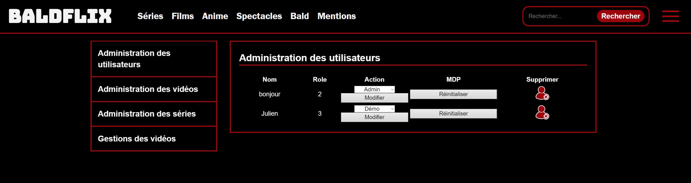
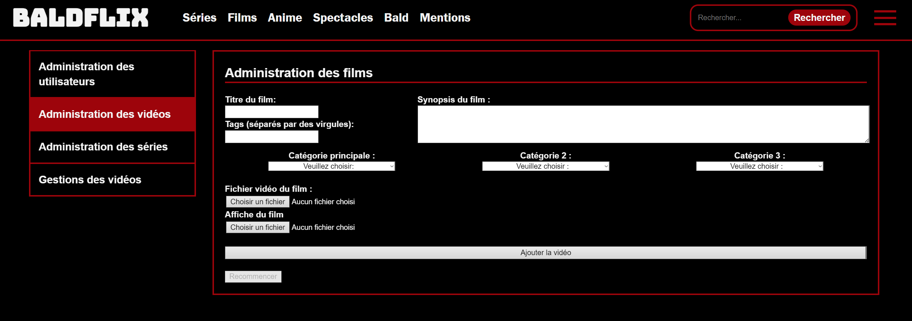
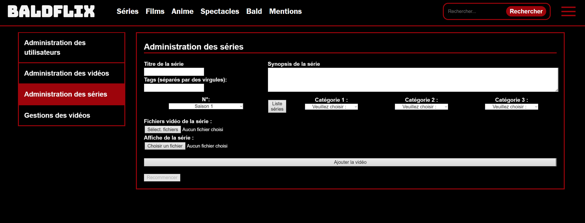
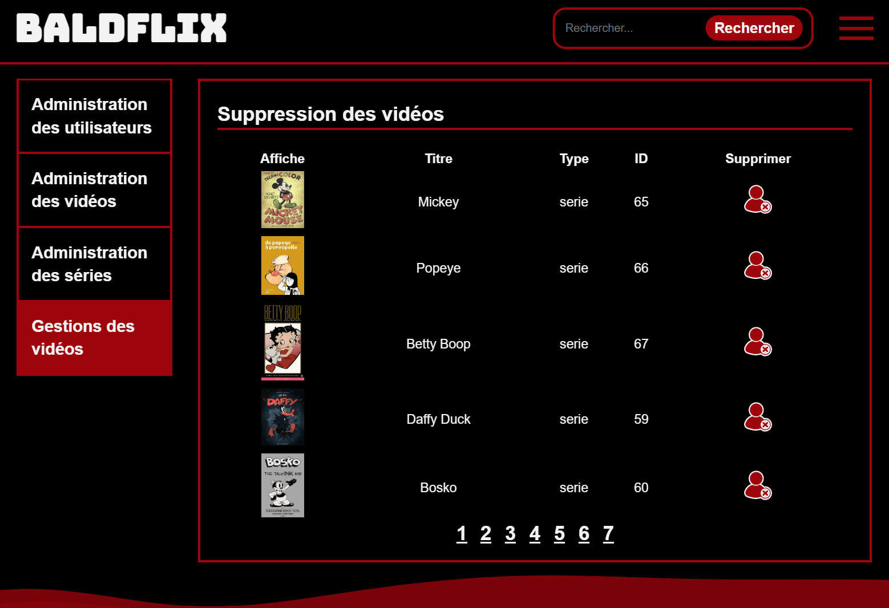

# Documentation Baldflix

## Table des Matières

- [Documentation Baldflix](#documentation-baldflix)
  - [Table des Matières](#table-des-matières)
  - [Introduction](#introduction)
  - [Compétences Abordées](#compétences-abordées)
  - [Cahier des Charges](#cahier-des-charges)
  - [Présentation de Baldflix](#présentation-de-baldflix)
  - [Gestion de Projet](#gestion-de-projet)
    - [Contraintes et Livrables](#contraintes-et-livrables)
    - [Architecture Logicielle](#architecture-logicielle)
    - [Maquettes](#maquettes)
  - [Présentation du site](#présentation-du-site)
  - [Partie administrateur](#partie-administrateur)
  - [Installation](#installation)
  - [Erreur](#erreur)
    
## Introduction

Bienvenue dans la documentation de Baldflix, un projet personnel qui m'a permit d'appliquer les connaissances apprisent en cours et personnel. Cette documentation vise à fournir un aperçu complet de la conception, du développement, et des caractéristiques techniques de Baldflix. 
## Compétences Abordées

Le développement de Baldflix a permis de couvrir un large éventail de compétences informatiques :

- **Développement Développement From-Scratch** : J'ai décidé de n'utiliser aucun framework pour la construction de l'application. Cela m'a permis d'apprendre la base du développement web et de m'amuser avec la création.
- **Développement Front-end** : Utilisation d'HTML, CSS pour structurer et styliser les pages, et JavaScript pour dynamiser les interactions utilisateur.
- **Développement Back-end** : Emploi de PHP pour le traitement côté serveur et la gestion de sessions, interaction avec la base de données.
- **Gestion de Base de Données** : Conception et manipulation de bases de données pour le stockage des informations relatives aux utilisateurs, séries, et épisodes.
- **Conception d'APIs** : Développement d'interfaces de programmation applicatives pour la communication entre le client et le serveur.
- **Sécurité Web** : Mise en œuvre de mesures pour protéger le site contre les vulnérabilités communes.
- **Design UI/UX** : Création d'interfaces utilisateurs intuitives et réactives.
- **Responsive Design** : Assurer une expérience utilisateur homogène sur tous les appareils.

## Cahier des Charges

Baldflix se positionne comme une plateforme d'hébergement vidéo, permettant aux utilisateurs de visionner des vidéos libres de droits. Les fonctionnalités clés incluent l'inscription, la connexion, la gestion de profil, et une navigation fluide entre les contenus.
Durant mon apprentissage, et suite aux conseils de mes professeurs, je me suis mis à ajouter une gestion "d'image utilisateur" afin de m'entrainer avant de m'attaquer aux videos.

## Présentation de Baldflix

Baldflix est un projet personnel centré sur le divertissement numérique, offrant un accès libre et gratuit à une large gamme de contenus vidéo. Le service se distingue par sa facilité d'utilisation, sa sécurité, et sa disponibilité sur divers appareils connectés. Mon contenu libre de droit vient de archive.org.

## Gestion de Projet

La réalisation de Baldflix a nécessité une gestion de projet, comprenant la planification, l'organisation, et le suivi de l'avancement grâce à des outils comme Trello.

### Contraintes et Livrables

Les contraintes du projet comprennent des exigences techniques, temporelles, et de ressources. Les livrables principaux sont le site web Baldflix et la documentation associée. Je souhaitai terminer une grosse partie du site avant mon entrée en C#. Cependant, je sors aujourd'hui la V.1, qui n'est pas entièrement finit. Je souhaite me consacrer pleinement à l'apprentissage du C#

### Architecture Logicielle

L'architecture de Baldflix repose sur une structure client-serveur, en séparant la logique métier de la présentation pour une maintenance et des mises à jour facilitées.

### Maquettes

La conception de Baldflix a été précédée par l'élaboration de maquettes détaillant l'interface utilisateur et l'expérience de navigation.

## Présentation du site
L'utilisateur a accès à une interface de navigation, qui lui permet de naviguer entre l'interface de connexion, l'interface d'inscription, l'interface de gestion de compte, et l'interface de recherche.
- Index [Interface de Baldflix](image/developpement/Index.png "Modification d'un utilisateur")
- Catégorie [Interface de Baldflix](image/developpement/Catégorie.png "Modification d'un utilisateur")
- Profil [Interface de Baldflix](image/developpement/Profile.png "Modification d'un utilisateur")

## Partie administrateur 
L'administrateur a accès à une interface de gestion des utilisateurs, des films et des séries. Il peut
- Modifier un utilisateur  
- Créer un nouveau film/serie  
- Supprimer un film/serie 
- 
## Installation

Je me suis entrainé sur mon Rasbperr Pi 5 pour le développement de baldflix. J'ai fait une page entière sur wikiJS qui explique comment faire pour réinstaller le serveur et le sécuriser chez vous. 

https://doc.florentbernar.fr/en/Système/Configuration/Nginx

## Erreur

J'ai probablement fait beaucoup d'erreur ou utiliser des mauvaises méthodes, j'ai fait de mon mieux avec mes connaissances et j'ai travailler après mes cours afin d'apprendre les technologies et languages qui m'ont servi à déployer la V1 de baldflix. Je suis ouvert à toutes critique ou améliorations. Je suis joignable par mail à contact@florentbernar.fr
